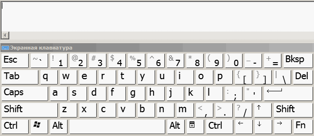
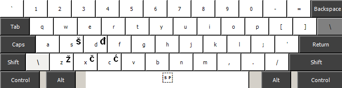

# English - Srpski Keyboard Layout (Dead Key)

This is a variant of the standard keyboard layout - USA (QWERTY).
Created with [Microsoft Keyboard Layout Creator](https://www.microsoft.com/en-us/download/details.aspx?id=102134).
Additional Serbian Latin characters are entered via dead key '\\':

- \\Z  ->  Ž
- \\S  ->  Š
- \\D  ->  Đ
- \\C  ->  Ć
- \\X  ->  Č
- \\\\  ->  \\

# Installation.

Download and extract the zip archive ["us_sr_dk"](https://github.com/corax4/English-Serpsi_Keyboard_DeadKey/releases/download/v1.0.0/us_sr_dk.zip). Run Setup.exe and follow the instructions of the installer. Reboot Windows.

Now you can select the installed keyboard layout:

1. Click Start and then click the Settings icon (which is shaped like a gear).

2. Click "Time & Language".

3. In the navigation pane on the left, click "Language".

4. In the "Preferred languages section", click "English" language and then click "Options".

5. Scroll down to "Keyboards" and then click "Add a keyboard". In the pop-up menu, click the "USA - Srpski DK" keyboard language to add. Now the default layout can be removed.

6. Close Settings.
